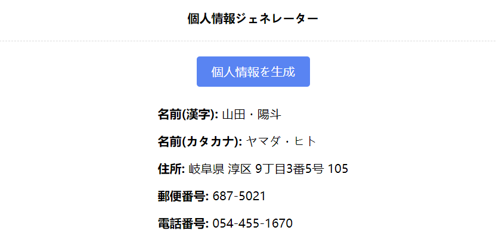

## Japanese Personal Information Generator

This tool allows you to generate temporary false personal information for use on websites, helping to protect your privacy. It is strictly for personal use, and please refrain from using it for corporate or profit-making purposes.

<br/>

**Demo:** https://jp-personal-information-generator.vercel.app/

### Project Overview

The project runs on **Node.js** and uses **Next.js**. When you click the generate button, the frontend requests data from the backend.

### Installation

To install the project, clone the repository and run the following command in your terminal:

```bash
npm install

# For debugging
npm run dev

# For production build
npm run build
```

### Project Features
- Generate Personal Information: By clicking the "Generate Personal Information" button, a Japanese name (in kanji and katakana), address, postal code, and phone number are automatically generated.
- Fake Information: All generated information is false and unrelated to any real individuals.
### Notes
- This tool is intended for the protection of personal privacy.
- Using it for profit or malicious purposes may violate the law, so please use it responsibly.
### Disclaimer
The developer assumes no responsibility for any issues arising from the use of this tool. Use it at your own risk.

***

### 日本の個人情報ジェネレーター

このツールを使用して、一時的に使用するサイト上で、虚偽の個人情報を生成し、プライバシーを保護することができます。あくまで個人利用に限りますので、企業や営利目的での利用はご遠慮ください。
<br/><br/>
プロジェクト実行環境は ***Node.js***です、
***next.js*** を使用し、生成ボタンをクリックすると、フロントエンドがバックエンド データをリクエストします。

### 実行メソッド
```bash
依存関係をインストールする：npm i
デバッグ：npm run dev
本番展開：npm run build
```

### プロジェクトの特徴

1. 「生成個人情報」ボタンをクリックすると、日本語の名前（漢字と片仮名）、住所、郵便番号、電話番号が自動生成されます。
2. 生成された情報はすべて虚偽であり、実在する人物とは無関係です。

### 注意事項

- このツールは個人のプライバシー保護を目的としています。
- 営利目的や悪意のある利用は法律に違反する可能性がありますので、責任をもって使用してください。

### 免責事項

本ツールの使用によって生じた一切の問題について、開発者は責任を負いません。あくまで自己責任でご利用ください。
